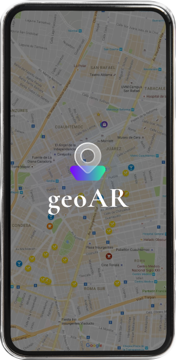

# geoAR

<p align="center">
    
</p>

## Description

geoAR is a React Native app that integrates with augmented reality to display location-based data in a 3D scene. Using AR capabilities, the app visualizes places in an AR scene based on user location and device orientation. Additionally, users can select a target location, and the app provides directional guidance using a compass. While initially created for a specific use case, it is open for adaptation to other projects.

## Features

- **AR Visualization**: Displays locations in an augmented reality (AR) environment using the [React Vision](https://github.com/ReactVision) library.
- **Location-Based Rendering**: Places objects in the AR scene based on the user’s GPS coordinates and device orientation.
- **Compass Navigation**: Guides users to a selected location using a compass overlay for real-time directional guidance.

## Background

This project was initially developed as a proof of concept for a specific Android-only use case and is my first project in React Native. While the code structure may not reflect production-level standards, it provides a foundation for AR-based location applications. Contributions and customizations are welcome!

## Getting Started

> **Note**: Make sure you have completed the [React Native - Environment Setup](https://reactnative.dev/docs/environment-setup) instructions. Stop before you get to the `Creating a new application` section; we have done that for you!

## Installing

1. `git clone https://github.com/alexandru-tiron/geoAR.git`
2. `cd geoar`
3. `npm install`

## Step 1: Start the Metro Server

First, you will need to start **Metro**, the JavaScript _bundler_ that ships _with_ React Native.

To start Metro, run the following command from the _root_ of your React Native project:

```bash
npm start
```

## Step 2: Start your Application

> **Warning**: Due to limitations of the Android Emulator, you must run your project on a physical device.

Let Metro Bundler run in its _own_ terminal. Open a _new_ terminal from the _root_ of your React Native project. Run the following command to start your _Android_ app:

```bash
# Android
npx react-native run-android
```

If everything is set up _correctly_, you should see your new app running in your _Android Emulator_ shortly provided you have set up your emulator/simulator correctly.

This is one way to run your app — you can also run it directly from within Android Studio respectively.

## Usage

This app is designed to be launched with location data provided from an external app. Here’s how you might structure incoming data:

`Target Locations`: Array of place objects found in `constants.ts`, each containing:

- `place_id`: Unique ID for the place
- `name`: Name of the location
- `locationlat` and `locationlng`: Coordinates of the location
- `address`: Address of the place
- `country` and `locality`: Country and city name
- `type`: Type of place (e.g., restaurant, park)
- `distance`: Distance from the user (optional)
- `photo_reference`: URL to a photo of the location
- `registered`: Boolean indicating if the location is registered

The app uses this data to render markers for each location in the AR scene, relative to the user’s position.

## Limitations

- **Single Use Case Focus**: Initially built for a specific scenario; the code may require adjustments for other applications.
- **Android-Only**: This project is configured for Android and may not function correctly on iOS.
- **API Compatibility**: While it accepts any list of places, additional coding might be needed to integrate with custom APIs directly

## Contributing

Pull requests are welcome. For major changes, please open an issue first to discuss what you would like to change.
